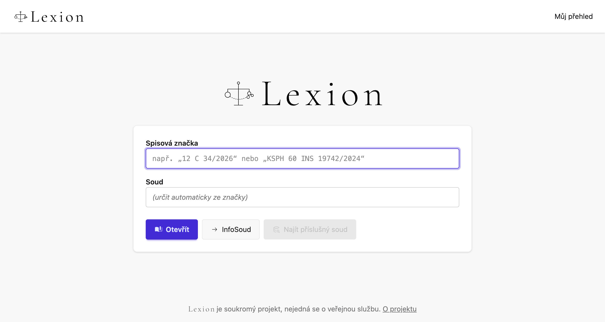

# Lexion

**Produkce: [lex.ion.cz](https://lex.ion.cz)**

Lexion je interní CRM systém pro práci se soudními spisy. Shromažďuje veřejně
dostupné informace o soudních řízeních a jednáních (infoSoud, infoJednání,
insolvenční rejstřík) a předkládá je v podobě, se kterou se dobře pracuje —
přehledně, rychle a bez zbytečného klikání.

## Proč Lexion vznikl

Oficiální rozhraní infoSoudu je pro každodenní práci nepohodlné: spisovou
značku je nutné vyplňovat po jednotlivých polích formuláře, k tomu je potřeba
vědět, u kterého soudu je spis veden. A hlavně — nijak neupozorní, když se ve
sledovaném spisu něco stane. Kdo chce mít přehled, musí spisy obcházet ručně,
nebo platit komerční monitorovací službu.

Lexion tyhle překážky odstraňuje. Ústřední myšlenkou je lidský přístup
k zadávání: spisovou značku stačí vložit jako obyčejný text v relativně volné
formě — třeba zkopírovanou z e-mailu i s okolními mezerami — a systém si ji
sám rozebere, ověří a pokusí se zjistit, kterému soudu spis patří. Uživatel
tak nemusí nic překlápět do formulářových políček ani dohledávat příslušnost
soudu po vlastní ose.

## Co Lexion umí dnes

Základní nástroje jsou dostupné komukoli bez přihlášení:

- **Vyhledání spisu spisovou značkou** — volný text, tolerantní k formátu,
  s živým našeptáváním při psaní. Systém značku rozpozná a tam, kde to jde,
  sám určí příslušný soud z vlastní evidence řízení a jednání.
- **Detail spisu** — průběh řízení jako přehledná časová osa událostí včetně
  jejich podrobností, související řízení (odvolání, dovolání, předchozí věci)
  a nařízená jednání s termínem a jednací síní. Data se drží v evidenci,
  takže opakované zobrazení je okamžité a šetrné ke zdrojovým serverům.
- **Přímý odkaz na infoSoud** — kdo chce zůstat u oficiálního rozhraní,
  dostane ze zadané značky rovnou hotový odkaz.
- **Statistiky evidence** — veřejný přehled, kolik spisů a z jakých soudů
  Lexion eviduje.

Autor projektu a jeho spolupracovníci mají po přihlášení k dispozici další,
neveřejné nástroje: automatizovaný sběr dat ze zdrojových systémů a osobní
přehled — oblíbené spisy s vlastními názvy a skupinami, aby se k často
používaným spisům dalo vracet jedním klikem.

## Co se plánuje

- **Sledování spisů a upozornění na změny** — hlavní motivace celého
  projektu. Místo ručního obcházení spisů dostane uživatel zprávu, když ve
  sledovaném řízení přibude nová událost, a zvlášť když soud nařídí jednání.
- **Historie posledních hledání** — při nárazové práci s více cizími spisy
  (v terénu, na mobilu) je otravné značky opakovaně opisovat; rychlý seznam
  naposledy otevřených spisů to vyřeší.
- **Vlastní poznámky ke spisům a evidence osob** — možnost připsat si ke
  spisu vlastní popis a propojit ho s lidmi, kterých se řízení týká.
- **Fulltextové hledání soudů** — jedno pole místo procházení hierarchie:
  „trut“ najde Okresní soud v Trutnově i Krajský soud v Hradci Králové.
- **Archiv rozhodnutí NS a NSS** — rozhodnutí nejvyšších soudů jsou veřejná
  jen krátce po vyhlášení; Lexion je uchová trvale.

## Povaha projektu

Lexion je soukromý projekt, nejedná se o veřejnou službu — přístup
k neveřejným částem uděluje autor. Podrobnosti jsou na stránce
[O projektu](https://lex.ion.cz/o-projektu) přímo v aplikaci.

Technická dokumentace pro vývoj je v [CLAUDE.md](CLAUDE.md) a v adresáři
[docs/](docs/).
